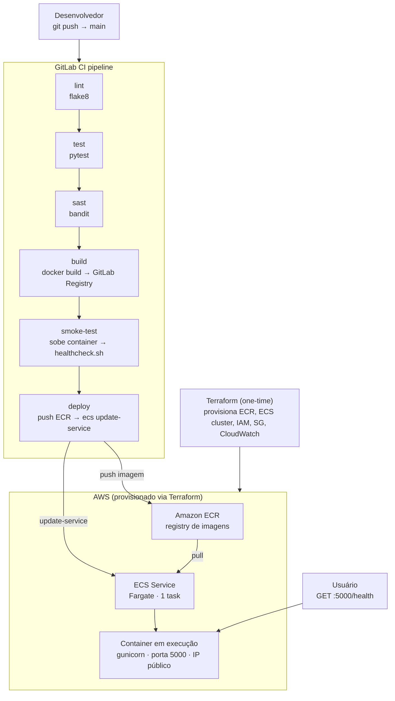

# ARCHITECTURE.md
Este documento descreve as decisões técnicas tomadas ao longo do desenvolvimento
do projeto: escolha de ferramentas, organização dos arquivos e trade-offs considerados.

---

## Estrutura do projeto

```
ProcessoSeletivoDevnology/
├── docs/
│   ├── ARCHITECTURE.md   # este arquivo
│   └── AI_USAGE.md       # documentação do uso de IA
├── terraform/            # provisionamento da infraestrutura AWS
│   ├── terraform.tf      # provider e versões
│   ├── variables.tf      # variáveis reutilizáveis
│   ├── main.tf           # recursos AWS
│   └── outputs.tf        # valores exibidos após o apply
├── .dockerignore         # arquivos ignorados pelo Docker no build da imagem
├── .gitignore            # arquivos ignorados pelo Git
├── .gitlab-ci.yml        # pipeline de CI/CD do GitLab
├── app.py                # aplicação Flask com endpoints / e /health
├── docker-compose.yml    # ambiente local isolado via Docker
├── Dockerfile            # build da imagem de produção (multi-stage)
├── healthcheck.sh        # script para verificar se a API está respondendo
├── requirements.txt      # dependências de produção
├── requirements-dev.txt  # dependências de desenvolvimento (inclui produção)
└── test_app.py           # testes unitários com pytest
```

Os arquivos `app.py`, `test_app.py` e `requirements.txt` foram fornecidos pelos
avaliadores. Os scripts Python não tiveram o funcionamento alterado em relação ao
original — apenas ajustes de estilo para conformidade com PEP 8, adição de
comentários e uma supressão de falso positivo do Bandit, detalhadas a seguir.

---

## Fluxo completo da aplicação



---

## Ambiente virtual Python (`.venv`)

O Ubuntu 24.04 bloqueia instalações de pacotes Python system-wide por padrão,
protegendo as dependências do sistema operacional de conflitos com pacotes de
projetos. A solução correta — e boa prática independente do sistema — é isolar
as dependências em um ambiente virtual por projeto.

Com `.venv`, cada projeto tem sua própria versão de cada pacote sem interferir
em outros projetos ou no Python do sistema. O diretório `.venv/` está no
`.gitignore` e as dependências são reproduzidas a partir dos arquivos
`requirements*.txt`.

---

## Divisão de dependências

O `requirements.txt` original incluía o `pytest`, o que resultava em uma imagem
Docker de produção com uma dependência de testes inutilizada, aumentando
desnecessariamente a superfície de ataque.

As listas foram divididas em duas responsabilidades distintas:

- **`requirements.txt`:** dependências de produção exclusivamente (`flask`, `gunicorn`). 
É o arquivo usado pelo Dockerfile.
- **`requirements-dev.txt`:** herda `requirements.txt` via `-r requirements.txt` e adiciona 
as ferramentas de desenvolvimento (`pytest`, `flake8`, `bandit`). 
É o arquivo usado localmente por quem desenvolve.

O pipeline do GitLab instala cada ferramenta individualmente no job que a utiliza,
sem depender de nenhum dos dois arquivos e garantindo que cada job tenha apenas
o que precisa.

---

## Dockerfile com multi-stage build

O objetivo do multi-stage foi separar o ambiente de instalação de dependências
do ambiente de execução final.

Um `pip install flask`, por exemplo, pode precisar de `gcc`, headers e
ferramentas de build para compilar dependências nativas. Essas ferramentas 
podem pesar dezenas de MB e não têm utilidade na imagem final, 
sendo necessárias apenas durante a instalação.

- **Stage `builder`:** possui pip e ferramentas de build. Instala as dependências
em `/install` e gera os pacotes prontos.
- **Stage final:** parte de uma imagem limpa e mínima (`python:3.12-slim`). Copia apenas
a pasta de pacotes do stage anterior, sem nenhuma ferramenta de build.

O resultado é uma imagem menor e com menos superfície de ataque. Menos
ferramentas instaladas significa menos vetores de exploração.

### Cache de layers

O `COPY requirements.txt .` é feito antes do `COPY app.py .` intencionalmente.
O Docker cacheia cada instrução como uma layer. Separando a cópia do
`requirements.txt` da cópia do código, o `pip install` só é reexecutado quando
as dependências mudam — não a cada alteração no código da aplicação.

### Health check no Dockerfile

O Dockerfile define um `HEALTHCHECK` que bate no endpoint `/health` a cada 30
segundos. Se o container falhar em todos os checks, o orquestrador (ECS ou outro)
o marca como `unhealthy` e pode substituí-lo automaticamente.

### Usuário não-root

O container roda como `appuser`, um usuário sem senha e sem privilégios de
administrador. Se a aplicação for comprometida, o atacante não terá acesso root
ao container.

---

## Escolha do gunicorn como servidor

O servidor embutido do Flask (`app.run()`) é single-thread e não possui tratamento 
robusto de erros HTTP, não sendo adequado para produção. O `gunicorn` é um servidor 
WSGI de produção que resolve ambos os problemas.

Flask é uma aplicação WSGI (síncrona). Dois workers foram configurados (`--workers 2`) 
para atender requisições simultâneas, adequado para o escopo do projeto.

---

## Docker Compose para desenvolvimento local

O `docker-compose.yml` serve três propósitos no desenvolvimento local:

1. Build automático da imagem a partir do Dockerfile, sem precisar rodar
`docker build` manualmente;
2. Mapeamento de porta declarativo, sem precisar lembrar o `-p 5000:5000` do
`docker run`;
3. Um único comando (`docker compose up --build`) que reproduz o ambiente de
forma consistente em qualquer máquina.

---

## Escolha do flake8 para lint

O flake8 verifica três camadas de qualidade do código Python:

- **Estilo:** indentação, espaços, comprimento de linha (PEP 8);
- **Qualidade:** imports não utilizados, variáveis declaradas mas nunca usadas;
- **Erros potenciais:** uso incorreto de operadores, funções sem retorno esperado.

O job de lint falha o pipeline se qualquer problema for encontrado, impedindo
que código com erros de estilo ou qualidade avance para os stages seguintes.

---

## Escolha do Bandit para SAST

O Bandit é a ferramenta padrão da indústria para SAST em Python, sendo inclusive o
que o GitLab usa em seu template oficial de CI para Python. Seu output é legível:
aponta exatamente o arquivo, a linha, a severidade e a descrição da
vulnerabilidade encontrada.

A flag `-ll` suprime alertas de severidade `LOW`, evitando ruído e focando o job
em problemas reais.

### Falso positivo suprimido

O Bandit levanta um alerta `B104` para o `host="0.0.0.0"` no `app.py`. O alerta
é tecnicamente correto — binding em todas as interfaces expõe o serviço para
tráfego externo — mas é intencional e necessário para que o container responda a
requisições vindas de fora.

O comentário `# nosec B104` na linha em questão suprime o alerta de forma
cirúrgica e documentada. É a forma oficial do Bandit para indicar que a linha foi
revisada conscientemente — diferente de ignorar o problema.

---

## Decisões do pipeline `.gitlab-ci.yml`

### Cache do pip entre pipelines

O pip por padrão salva cache em `/root/.cache`, fora do diretório do projeto. O
GitLab só consegue persistir cache de caminhos dentro de `$CI_PROJECT_DIR`, então
`PIP_CACHE_DIR` é redirecionado para `.cache/pip`. Na prática, os pacotes não são
baixados do zero a cada pipeline.

A chave de cache usa `$CI_COMMIT_REF_SLUG` (nome da branch sanitizado) para que
branches diferentes não compartilhem cache incompatível entre si.

### Job template `.docker-base`

Os stages `build` e `smoke-test` compartilham a mesma configuração base: imagem
`docker:24`, serviço `dind` e login no registry. Repetir esse bloco nos dois jobs
seria redundante e difícil de manter.

O template `.docker-base` centraliza essa configuração. O ponto no início do nome
instrui o GitLab a não executá-lo diretamente — ele só existe para ser herdado
via `extends`. O `before_script` do template (login no registry) é executado
automaticamente antes do `script` de cada job filho.

### Stage `smoke-test`

O stage `test` valida o código-fonte com pytest. O `smoke-test` vai além: sobe
o container da imagem que acabou de ser buildada e valida que ela funciona de
fato como artefato, não apenas que o código passa nos testes unitários.

Isso detecta problemas que só aparecem na imagem real: dependências faltando no
`requirements.txt`, erro de configuração do gunicorn, porta não exposta
corretamente.

### Ordem de push das imagens

O push para o ECR acontece no stage `deploy`, não no `build`. Isso é intencional:
a imagem só chega ao registry de produção após ser validada pelo `smoke-test`.
Se o push fosse no `build`, uma imagem quebrada poderia chegar ao ECR antes do
pipeline barrá-la.

```
build       → push para GitLab Registry
smoke-test  → valida a imagem do GitLab Registry
deploy      → push para ECR + deploy no ECS
```

### Stage `deploy` (imagem base)

O job de `deploy` usa `amazon/aws-cli` como imagem base em vez de herdar o
`.docker-base`. O motivo é incompatibilidade do `aws-cli` com Alpine Linux
(base da imagem `docker:24`). A `amazon/aws-cli` é Amazon Linux 2023 e tem o
CLI correto nativamente, onde Docker CLI é instalado via `yum` sem conflito.

Como imagem, services, variables e before_script são completamente diferentes do
template, herdar via `extends` não acrescentaria nada.

O TLS do dind foi desativado neste job (porta `2375`, `DOCKER_TLS_CERTDIR: ""`)
por incompatibilidade entre a imagem `amazon/aws-cli` e o handshake TLS do dind.
A comunicação é interna ao job, tornando o trade-off aceitável.

---

## Infraestrutura AWS (Terraform)

O provisionamento usa Fargate, eliminando a necessidade de gerenciar servidores.
A VPC padrão da conta é reutilizada para simplificar; em produção, criaria-se
uma VPC dedicada com subnets públicas e privadas separadas.

**Recursos provisionados:**

| Recurso | Finalidade |
|---|---|
| ECR repository | Armazena as imagens Docker para o ECS |
| IAM execution role | Permite ao Fargate puxar imagens do ECR e escrever logs |
| CloudWatch log group | Recebe stdout/stderr do container (retenção de 7 dias) |
| Security group | Libera entrada na porta 5000, saída livre |
| ECS cluster | Agrupamento lógico dos serviços |
| ECS task definition | Descreve o container: imagem, CPU, memória, porta, logs |
| ECS service | Mantém a task em execução, substitui containers unhealthy |

### Acesso público sem load balancer

Em produção, um Application Load Balancer ficaria na frente do ECS. Para esta
demonstração, `assign_public_ip = true` foi habilitado diretamente na task
Fargate, onde o container recebe um IP público e fica acessível na porta 5000.
Esta abordagem não é adequada para produção (o IP muda a cada redeploy), mas
é suficiente para demonstrar o funcionamento.

### Health check no ECS

A task definition define um health check que espelha o do Dockerfile, mas no
nível do orquestrador. O Dockerfile verifica se o processo está vivo; o ECS
verifica se a task merece receber tráfego. São camadas complementares.

### Variáveis de CI/CD necessárias

Após o `terraform apply`, os outputs fornecem os valores para configurar as
seguintes variáveis em **GitLab → Settings → CI/CD → Variables**:

| Variável | Origem |
|---|---|
| `AWS_ACCESS_KEY_ID` | IAM user do pipeline |
| `AWS_SECRET_ACCESS_KEY` | IAM user do pipeline |
| `AWS_DEFAULT_REGION` | Definida manualmente |
| `ECR_REPOSITORY_URL` | Output `ecr_repository_url` do `terraform apply` |

---

## Troubleshooting do stage de deploy

O stage de deploy passou por quatro iterações até funcionar. O processo está
documentado aqui por ser ilustrativo sobre como diagnosticar problemas de
compatibilidade de imagens em CI:

* **Problema 1: conflito de biblioteca no Alpine**
  
  A primeira abordagem instalou o `aws-cli` via `apk` na imagem `docker:24`
(Alpine). O pipeline falhou com erro de símbolo não encontrado no `libexpat`.
A imagem Alpine do Docker é minimalista e não possui todas as libs C que o
`aws-cli` do `apk` espera.

* **Problema 2: AWS CLI não encontrado após instalação manual**
  
  A segunda abordagem instalou o AWS CLI v2 via instalador oficial. O CLI era
instalado mas não estava no PATH no momento da execução, causando
`aws: not found`.

* **Problema 3: entrypoint bloqueando execução dos scripts**
  
  A terceira abordagem trocou para a imagem `amazon/aws-cli`. O pipeline falhou
porque essa imagem define `aws` como entrypoint — o GitLab Runner tentava
executar `sh script.sh` mas o container recebia `aws sh`, que não existe.
Fix: `entrypoint: [""]` na declaração da imagem.

* **Problema 4: falha de TLS no dind**
  
  Com o entrypoint corrigido, o `docker login` falhou com erro de TLS. A imagem
`amazon/aws-cli` não monta os certificados gerados pelo dind, então o Docker
CLI tentava conexão HTTPS sem os certs. Fix: desativar TLS no dind
(`DOCKER_TLS_CERTDIR: ""`, porta `2375`).

---

## O que eu faria com mais tempo

- **Testes de integração:** os testes atuais são unitários e usam o cliente de
  teste do Flask. Adicionaria testes que sobem a aplicação real e fazem
  requisições HTTP de verdade.
- **VPC dedicada:** em produção, criaria VPC com subnets públicas e privadas
  separadas, colocando o container na subnet privada e o ALB na pública.
- **Application Load Balancer:** eliminaria o IP público direto na task,
  tornando o endpoint estável entre redeploys.
- **Versionamento semântico automatizado:** a `version` no endpoint `/health`
  está hardcoded. Automatizaria via git tags e injeção como variável de ambiente
  no pipeline.
- **Rollback automatizado:** adicionaria lógica de rollback caso o
  `aws ecs wait services-stable` retorne falha após o deploy.
